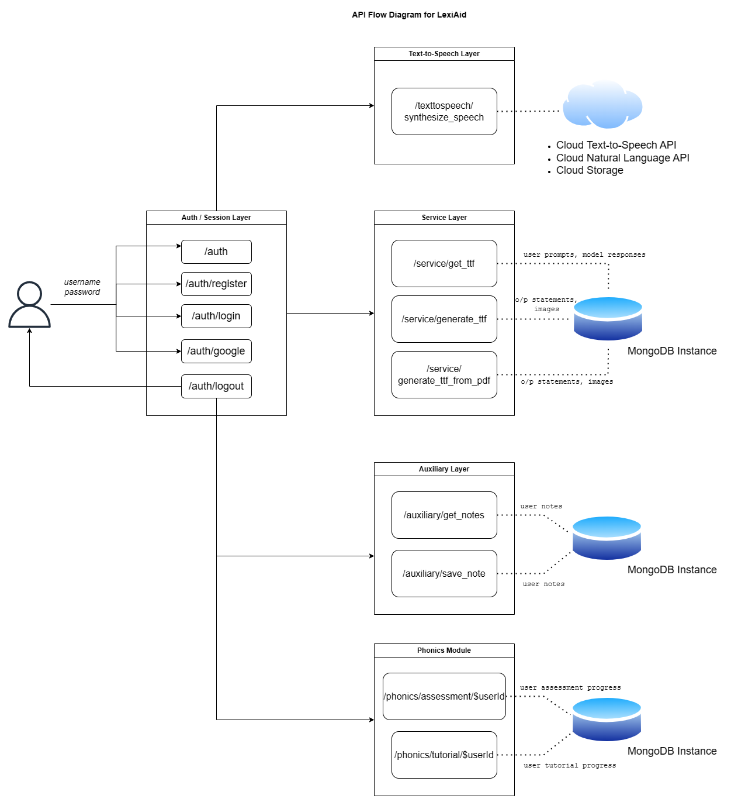
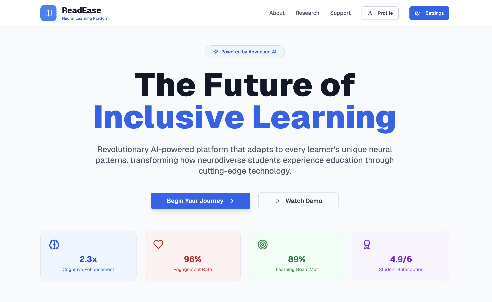
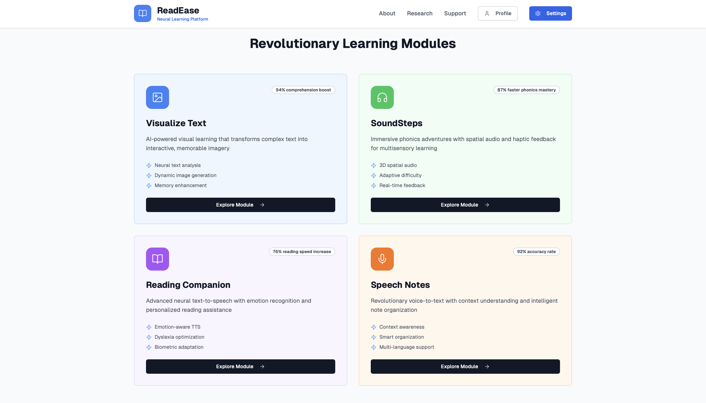

# 🧠 ReadEase: Inclusive Learning Platform for Neurodiverse Students

**ReadEase** is an inclusive learning platform built to support **neurodiverse students**, particularly children with **dyslexia**, by offering a personalized, multisensory learning experience. The platform integrates speech, visuals, phonics, and assistive UI design to help learners engage with educational content in a way that suits their cognitive needs.

---

## 🎯 Key Features

### 🖼️ Visualize Text (Text-to-Image)
Transforms input text into relevant contextual images to help students better understand and retain meaning through visual association.

### 🎮 SoundSteps (Phonics Learning)
A phonics module that includes interactive games and structured lessons, carefully designed to maintain simplicity while introducing progressive complexity.

### ♿ Accessibility Features
- Dyslexia-friendly font (OpenDyslexic)
- High-contrast themes and customizable background/text colors
- Adjustable font sizes and extra text spacing for improved readability

### 🔊 Reading Companion (Text-to-Speech)
An immersive reader that reads content aloud with customizable voice options (reader type, pitch, speed) to support auditory learning.

### 🎙️ Speech Notes (Voice-Assisted Notes)
Speech-to-text feature allowing users to dictate notes verbally, making note-taking easier for students with motor or processing difficulties.

---

## 🧩 System Architecture

ReadEase uses a modular web architecture with an intuitive frontend and a Flask-based backend. Each module interacts with backend services via API calls for tasks such as:

- Generating contextual images from text
- Delivering phonics lessons
- Performing text-to-speech and voice recognition



---

## 🚀 Getting Started

### 🔧 Backend Setup

1. Navigate to the backend directory:
   ```bash
   cd backend
   ```

2. Create and activate a virtual environment:
   ```bash
   python3 -m venv venv
   source venv/bin/activate
   ```

3. Install required dependencies:
   ```bash
   pip install -r requirements.txt
   ```

4. Run the Flask server:
   ```bash
   flask --app flaskbackend run --debug
   ```

---

### 💻 Frontend Setup

1. Navigate to the frontend directory:
   ```bash
   cd frontend
   ```

2. Install dependencies:
   ```bash
   npm install
   ```

3. Start the development server:
   ```bash
   npm start
   ```

4. Open your browser and visit:
   ```
   http://localhost:3000
   ```

---

## 🖼️ Snapshots

### Homepage


### Learning Area


---

## 🙌 Conclusion

**ReadEase** bridges the gap in education for neurodiverse learners by offering an adaptable, child-friendly, and scientifically supported approach to learning. It aims to enable every child to thrive by learning in the way that works best for them.

> _“Empowering different minds through inclusive design.”_
